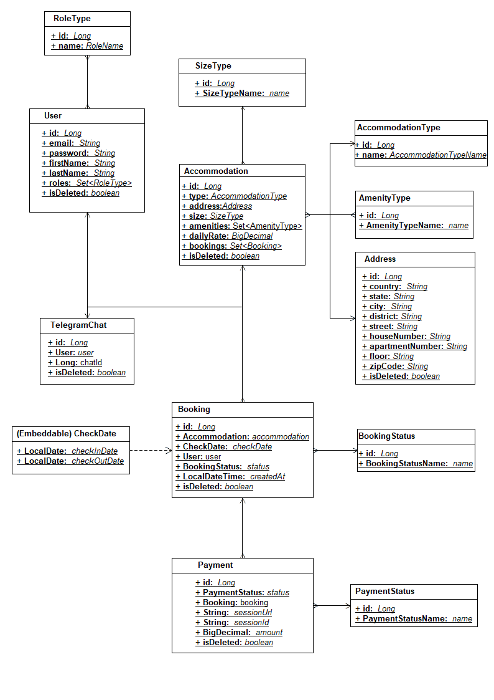

# BookingApplication


## Project Description
Imagine a booking service in your area, offering individuals the opportunity to rent homes, apartments, and other accommodations for their chosen duration. Currently, this service faces significant operational challenges due to antiquated, manual processes for managing properties, renters, financial transactions, and booking records. Our project addresses these issues by creating an efficient online platform for managing housing rentals, transforming the way people experience accommodation booking.

## Technologies
Here's a breakdown of the main technologies used in this project:

### Frameworks and Libraries
- **Spring Boot(3.4.2)**: Framework for building Java-based applications. It provides a comprehensive set of tools for building RESTful APIs, integrating with databases, and more.
- **Spring Data JPA(3.4.2)**: Allows for seamless interaction with relational databases using JPA (Java Persistence API).
- **Spring Security(3.4.2)**: Provides authentication and authorization capabilities, with JWT support.
- **Springdoc OpenAPI(latest compatible version)**: Offers OpenAPI (Swagger) documentation for your RESTful APIs.

### Database and ORM
- **PostgreSQL(latest stable version)**: The primary database for storing booking information, user data, and other details.
- **Liquibase(4.23.1)**: A tool for managing database migrations and version control for schema changes.
- **MapStruct(1.5.5.Final**: A mapping framework for converting between data objects and DTOs.

### Testing
- **JUnit(latest stable version)**: The primary testing framework.
- **Testcontainers(latest stable version)**: Allows for integration testing with real database instances.
- **Mockito(latest stable version)**: Provides support for mocking dependencies in tests.

### Messaging and Integration
- **Telegram Bots(6.8.0)**: Integration with Telegram for automated messaging and notifications.
- **Stripe(24.0.0)**: A platform for handling online payments and transactions.

### Utilities
- **Lombok(latest stable version)**: Helps reduce boilerplate code for entity classes and more.
- **Checkstyle(latest stable version)**: A tool to ensure code style consistency.
- **Docker Compose(latest stable version)**: Facilitates running multiple Docker containers for development and testing.

## Project Structure
The project follows the standard Spring Boot structure with controllers, services, and repositories. The `src` directory contains the source code, and the `test` directory includes test cases.

## UML Diagram of the system's models
The UML diagram provides a visual representation of the relationships between the entities (models) in the system. It shows how entities like User, Accommodation, Booking, and Payment are related to each other and how they interact in the system. This helps in understanding the overall structure and flow of the system.

## Setup
To set up and run the project locally, follow these steps:

1. **Clone the repository:**
   ```bash
   git clone https://github.com/RCherniavskiy/BookingApplication.git
   cd booking-application
   ```
2. **Ensure you have Java 17 installed.**
3. **Ensure you have Maven installed.**
4. **Ensure you have Docker installed.**
5. **Update the database configuration in the `.env` file.**
6. **Build the project using Maven:**
   ```bash
   mvn clean package
   ```
7. **Build the image using Docker:**
   ```bash
   docker compose build
   ```
8. **Run the application using Docker:**
   ```bash
   docker-compose up
   ```

## Example .env
```yaml
###PostgreSQL###
POSTGRES_USER=postgres
POSTGRES_PASSWORD=password
POSTGRES_DATABASE=test
POSTGRES_LOCAL_PORT=5434
POSTGRES_DOCKER_PORT=5432

###DOCKER###
SPRING_LOCAL_PORT=8081
SPRING_DOCKER_PORT=8080
DEBUG_PORT=5005

###JWT###
JWT_SECRET=helloworldIamfromdifferentcitybutiwanttoliveinnirvana
JWT_EXPIRATIONS=3600000

###STRIPE_SECRET_KEY###
STRIPE_SECRET_KEY=
STRIPE_CANCEL_URL=http://localhost:8081/payments/cancel/{CHECKOUT_SESSION_ID}
STRIPE_SUCCESS_URL=http://localhost:8081/payments/success/{CHECKOUT_SESSION_ID}

###TELEGRAM###
BOT_NAME=
BOT_TOKEN=
TELEGRAM_SECRET=helloworld123bye
```

## For use
1. **User 1:**
    - **Email:** adm@i.com
    - **Password:** admADM200@
    - **Authorities:**
        - ADMIN
        - CUSTOMER

2. **User 2:**
    - **Email:** usr@i.com
    - **Password:** admADM200@
    - **Authorities:**
        - CUSTOMER

## Postman Collection
For a quick start, use the provided [Postman collection](https://www.postman.com/lunar-comet-638867/workspace/booking-application/collection/33014096-f9d163a4-d04f-4f07-b7d1-402d0bd090a7?action=share&creator=33014096) to test the API endpoints. Import the collection into Postman and follow the included documentation.

## Acknowledgments
Special thanks to the Spring Boot community and the contributors to the libraries and tools used in this project. Your dedication and expertise make projects like these possible.

Feel free to explore, contribute, and provide feedback. Happy coding!

